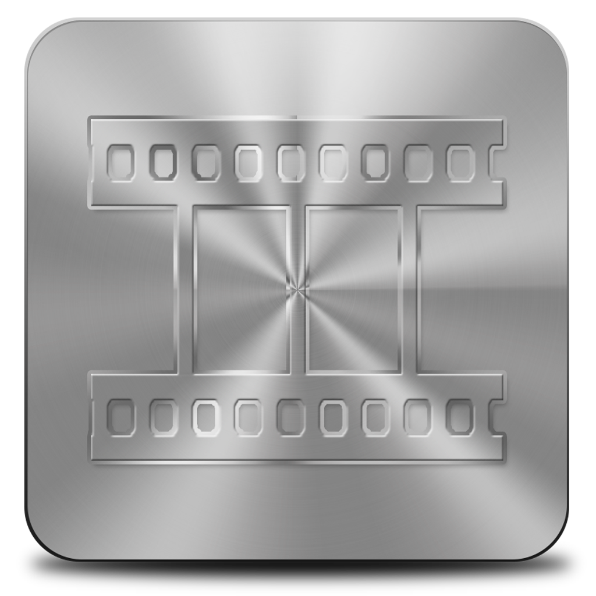

<p align="center">
  
  <h1 align="center">Perfect Grid</h1>
</p>

<p align="center">
  
  
  
</p>

Perfect Grid is a free, open source desktop app for creating video contact sheets and preview thumbnails from local video files. Drop in a video, pick your layout, and export a high-quality PNG contact sheet.

Built for editors, collectors, archivists, and anyone who wants a quick visual summary of a video.

<p align="center">
  
  <br>
  <em>Example contact sheet generated with Perfect Grid.</em>
</p>

<p align="center">
  <a href="https://github.com/worstgirlinamerica/PerfectGrid/releases/latest/download/PerfectGrid-v0.1.2-macos-universal.zip">
    
  </a>&#8203; &nbsp;
  <a href="https://github.com/worstgirlinamerica/PerfectGrid/releases/latest/download/PerfectGrid-v0.1.2-Windows-x86_64.zip">
    
  </a>&#8203; &nbsp;
  <a href="https://github.com/worstgirlinamerica/PerfectGrid/releases/latest/download/PerfectGrid-v0.1.2-Linux-x86_64.AppImage">
    
  </a>
</p>

## Features

- Generate high-quality PNG contact sheets
- Fully customizable grid layouts
- Optional timecode overlays
- Video metadata display (resolution, codecs, duration, file size, etc.)
- Smart frame selection with **Refine Picks**
- Save and reuse custom presets
- Batch processing
- Runs on Windows, macOS, and Linux

## Localization

The app UI is available in 8 languages. Sheet filename rendering is a separate system — it draws filenames as pixels on the exported PNG, which requires script-specific font handling.

| Language | UI | On sheet |
|---|---|---|
| English | Yes | Yes |
| Chinese (中文) | Yes | Yes (macOS, Windows) |
| Portuguese (PT) | Yes | Yes |
| Spanish (ES) | Yes | Yes |
| Japanese (JA) | Yes | Yes (macOS, Windows) |
| French (FR) | Yes | Yes |
| German (DE) | Yes | Yes |
| Korean (KO) | Yes | Yes (macOS, Windows) |
| Arabic / RTL | — | Yes |
| Hebrew | — | — |
| Thai | — | — |
| Devanagari (Hindi, etc.) | — | — |

> Linux non-ASCII filename rendering is not currently supported — filenames in non-Latin scripts will show as boxes. This will be fixed in the next release!

## Basic Usage

1. Open Perfect Grid.
2. Drag a video into the window.
3. Adjust the grid layout and styling. If you change the layout, click **Refresh Preview** to regenerate thumbnails.
4. Previews are lower quality on purpose — exports always use your selected quality setting.
5. (Optional) Under the **Range** tab, use **Refine Picks** for smarter frame selection.
6. Pick an export quality under **Range**: **Fast (1080p)**, **Detail (1440p)**, or **Maximum (4K)**.
7. Click **Export PNG**.

## Download And Install

Download the latest release for your OS from the [Releases](https://github.com/worstgirlinamerica/PerfectGrid/releases/latest) page.

### macOS

1. Download `PerfectGrid-v0.1.2-macos-universal.zip`.
2. Double-click to extract, then drag Perfect Grid into Applications.
3. Open `Perfect Grid.app`.

> macOS will block the app on first launch since it's unsigned. Right-click → **Open** → **Open** to get past it. If it still won't open, run this in Terminal: `xattr -cr "/Applications/Perfect Grid.app"`

### Windows

1. Download `PerfectGrid-v0.1.2-Windows-x86_64.zip`.
2. Right-click → **Extract All**, then open the folder.
3. Double-click `Perfect Grid.exe`.

> Windows SmartScreen may warn you since the app isn't code-signed. Click **More info** → **Run anyway**.

### Linux

1. Download `PerfectGrid-v0.1.2-Linux-x86_64.AppImage`.
2. Make it executable and run it:
```bash
chmod +x PerfectGrid-v0.1.2-Linux-x86_64.AppImage
./PerfectGrid-v0.1.2-Linux-x86_64.AppImage
```

No install needed — FFmpeg and all dependencies are bundled. Works on most x86_64 distros (Ubuntu 22.04+, Fedora, Arch, etc.).

> If you get a FUSE error: `sudo apt install fuse` (Debian/Ubuntu) or `sudo dnf install fuse` (Fedora).

## Privacy

Everything runs locally. No analytics, no telemetry, no uploads. FFmpeg and FFprobe are bundled.

## Notes

- Supports MP4, MOV, MKV, AVI, WebM, and anything FFmpeg can read.
- AV1 and VP9 decoding can be slow on older hardware.
- macOS builds are unsigned — see install note above.

<details>
<summary>For Developers</summary>

```bash
python -m pip install -r requirements.txt
PYTHONPATH=src python -m perfect_grid.app
```

For full Arabic/RTL filename support when running from source:

```bash
pip install arabic-reshaper python-bidi
```

Build scripts are in `scripts/`. GitHub Actions builds Windows and Linux releases automatically on tagged pushes. macOS is built manually.

</details>

## Contributing

Bug reports are welcome. Useful ones include your OS, video format, and whether the issue was in preview, refine, export, or batch.

See [CONTRIBUTING.md](CONTRIBUTING.md) for more.

## License

MIT. See [LICENSE](LICENSE).
