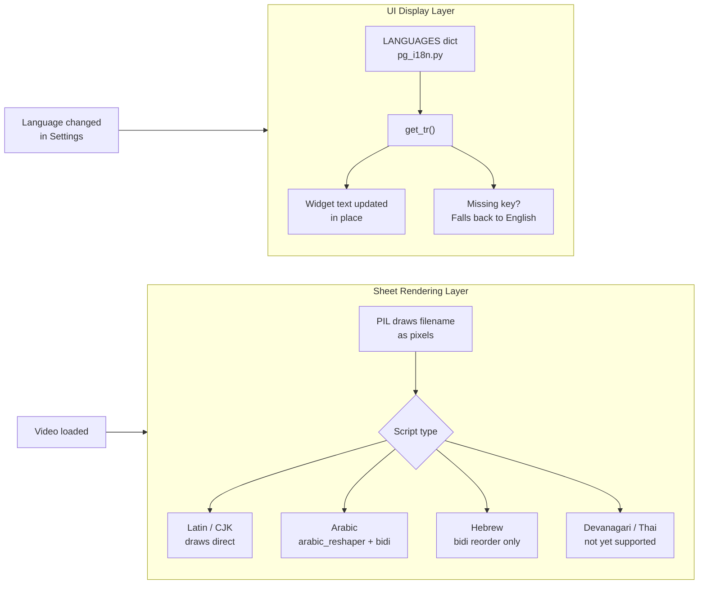

# Localization in Perfect Grid

  

Perfect Grid has two separate localization systems that work independently of each other, one for the app UI, and one for how filenames are drawn onto contact sheets. They're triggered by different things and have different requirements, which is why a language can work perfectly in the interface but still show boxes on a sheet (or vice versa).

---

| [Supported Languages](#supported-languages) | [UI Layer](#how-the-ui-layer-works) | [Sheet Rendering](#how-the-sheet-rendering-layer-works) | [Not Yet Supported](#whats-not-fully-supported-as-of-v012) | [Adding a Language](#adding-a-language) |
|:---:|:---:|:---:|:---:|:---:|

---



---

## Supported Languages

| Language | Code | Script | UI | Sheet |
|:---|:---:|:---:|:---:|:---:|
| English | `en` | Latin | ✅ | ✅ |
| Chinese (Simplified) | `zh` | CJK | ✅ | ✅ |
| Portuguese | `pt` | Latin | ✅ | ✅ |
| Spanish | `es` | Latin | ✅ | ✅ |
| Japanese | `ja` | CJK + Kana | ✅ | ✅ |
| French | `fr` | Latin | ✅ | ✅ |
| German | `de` | Latin | ✅ | ✅ |
| Korean | `ko` | Hangul | ✅ | ✅ |

"Sheet" means: if you drag in a video whose filename is written in that script, it will display correctly on the exported contact sheet.

---

## How the UI Layer works

Every string visible in the app (buttons, labels, tabs, error messages) has a key in `src/perfect_grid/pg_i18n.py`. The `LANGUAGES` dictionary maps each language code to a full set of those strings.

> [!TIP]
> Dropdown Menu strings are currently English only, and this is being refactored.

<details open>
<summary>Example from <code>pg_i18n.py</code></summary>

```python
LANGUAGES = {
    "en": {
        "export_png": "Export PNG",
        "no_frames":  "No preview frames found",
        ...
    },
    "zh": {
        "export_png": "导出 PNG",
        "no_frames":  "未找到预览帧",
        ...
    },
}
```

</details>

`get_tr()` takes a language code and returns a translator function. That function, called `tr` throughout the app, is what every widget uses to look up its display string by key. You'll see it called at the top of `app.py` when the app initializes, and again inside `retranslate_ui()` whenever the language changes.

```python
tr = get_tr("zh")
tr("export_png")  # → "导出 PNG"
tr("no_frames")   # → "未找到预览帧"
```

When you change the language in Settings and hit OK, `retranslate_ui()` in `app.py` runs and swaps every visible widget's text in place. No restart required. If a key is missing in a language block, `get_tr()` falls back to the English value rather than crashing or showing a blank.

---

## How the Sheet Rendering Layer works

This is completely separate from the UI system. When you drag in a video, PIL (Python Imaging Library) draws the filename directly onto the contact sheet image as pixels, not as text that a font renderer handles, but literally rasterized glyphs burned into the image.

Latin scripts draw fine with no extra handling. Non-Latin scripts are where it gets complicated.

### CJK (Chinese, Japanese, Korean)

Draw correctly as-is. On macOS, PingFang SC covers the full CJK range. On Linux, a Noto CJK font needs to be present, otherwise you'll get boxes.

### Arabic

Arabic is the most complex case. Two things have to happen before PIL can draw it correctly:

**1. Reshaping** — Arabic letters change form depending on where they appear in a word (isolated, initial, medial, or final position). Unicode stores the *logical* form of each letter, but PIL needs the correct *visual* form. `arabic_reshaper` handles this conversion.

**2. Bidi reorder** — Arabic is written right-to-left, but computers store text left-to-right. The Unicode Bidirectional Algorithm (bidi) defines how to reorder characters for correct visual display. `python-bidi` handles this, taking the logically-ordered string and reversing it into display order before PIL draws it.[^1]

Both steps run together: reshape first, then bidi, then draw. On macOS, GeezaPro is prioritized for Arabic text since it has full coverage.

### Hebrew

Also right-to-left, so the bidi reorder applies, but Hebrew letters don't change shape by position the way Arabic does, so no reshaper is needed. The bidi reorder alone should give correct direction. Not explicitly tested, likely works on macOS via Arial Unicode MS, likely boxes on Linux.

### Farsi / Persian

Uses Arabic script, so it goes through `arabic_reshaper` + bidi the same way Arabic does. Farsi-specific ligatures may not form correctly with the current reshaper config, so probably mostly readable but not guaranteed.

### Thai

No reshaping needed, but Thai has no spaces between words and uses stacking diacritics that require careful vertical metrics. macOS includes Thonburi in the font fallback list. Linux will box out.

### Devanagari (Hindi, Sanskrit, Nepali, Marathi)

Needs glyph combination similar to Arabic reshaping, but handled by a different library (`uharfbuzz`). Not currently implemented, will show boxes on all platforms.

### Linux non-Latin filenames

The font priority list falls back to PIL's built-in bitmap font if no system font matches the script. Non-ASCII filenames will likely box out on Linux regardless of script. Bundling Noto Sans with the app is planned as a fix.

---

## What's not fully supported as of v0.1.2

| Script | UI | Sheet | Notes |
|:---|:---:|:---:|:---|
| Hebrew | ✅ | ⚠️ | bidi applied, untested, likely boxes on Linux |
| Farsi / Persian | ✅ | ⚠️ | reshaper + bidi run, ligatures may be off |
| Thai | ✅ | ⚠️ | macOS only, Linux boxes |
| Devanagari | ✅ | ❌ | no reshaper implemented yet |
| Linux non-Latin | ✅ | ❌ | font fallback fails, Noto bundle planned |

> [!NOTE]
> UI support is always ✅ for any language you add. The UI system just looks up strings from a dict and falls back to English if anything is missing. Sheet support depends entirely on the script and platform.

---

## Adding a language

See [ADDING_A_LANGUAGE.md](./ADDING_A_LANGUAGE.md) for the full walkthrough.

---

[^1]: The [Unicode Bidirectional Algorithm](https://unicode-org.github.io/icu/userguide/transforms/bidi.html) is a spec that defines how mixed left-to-right and right-to-left text should be visually ordered. Arabic and Hebrew are the main cases where this matters for sheet rendering.
